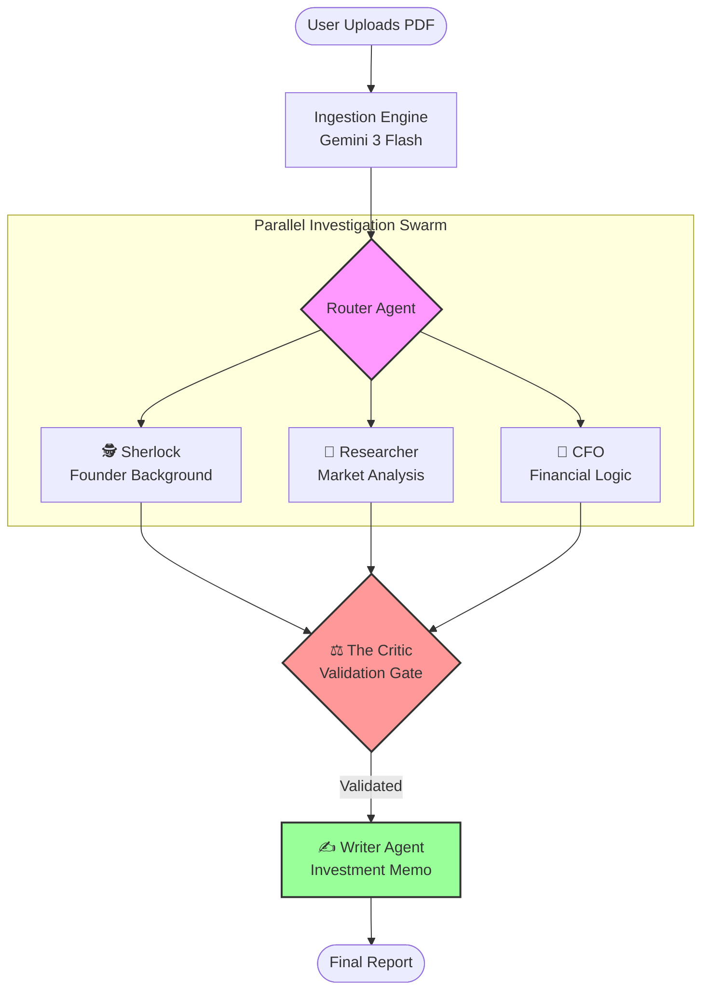

# Argus VC: The Autonomous AI Investment Committee


**Argus VC** is an agentic AI system designed to automate the initial due diligence process for Venture Capital firms. It employs a **Hub-and-Spoke** architecture where a central Router orchestrates specialized agents to analyze a startup's pitch deck from multiple angles, culminating in a rigorous validation loop ("The Critic") before generating a final Investment Memo.

## 🏗 Concept & Architecture
Yes, absolutely. A visual flow is perfect for explaining the "Hub-and-Spoke" architecture.

Here is the Mermaid code specifically designed for Argus VC. It accurately reflects the parallel processing of your agents (Sherlock, Researcher, CFO) and the critical validation step before the final output.

Copy the code below and paste it into your README.md right after the "Concept & Architecture" section (or anywhere you prefer).

Updated README Section with Diagram
Markdown

The system mimics a real investment committee.


The system mimics a real investment committee:

1.  **Ingestion (Multimodal)**: Uses **Gemini 3 Flash** to natively "see" and understand charts, graphs, and financial tables in the uploaded PDF pitch deck.
2.  **The Router**: Extracts key entities (Founders, Competitors, Claims) and dispatches jobs.
3.  **Specialized Agents**:
    *   **🕵️‍♂️ Sherlock**: Performs background checks on founders using live web search (Tavily) to flag red flags or past exits.
    *   **🔬 Researcher**: Analyzes the market, verifying if the propery is a "blue ocean" or crowded, using real-time news search.
    *   **🧮 CFO**: Sanity checks financial projections (e.g., matching revenue claims to user counts).
4.  **The Critic (The Gatekeeper)**: A separate adversarial agent that cross-references all agent reports against the ground truth PDF. It detects hallucinations and rejects claims that contradict the source material.
5.  **The Writer**: Synthesizes validated data into a concise, partner-level Investment Memo.

## ✨ Features

*   **Multimodal Ingestion**: No OCR flakiness. The model sees the document pages directly.
*   **Live Web Search**: Real-time investigation of people and markets via Tavily API.
*   **Hallucination Guardrails**: The "Critic" node ensures the final output is grounded in reality.
*   **Reactive UI**: A clean **Streamlit** dashboard for uploading decks and viewing live progress.

## 🚀 Quick Start

### Prerequisites
*   Python 3.11+
*   Google AI Studio Key (for Gemini 3)
*   Tavily API Key (for Search)

### Installation

1.  **Clone the repository**
    ```bash
    git clone https://github.com/your-username/argus-vc.git
    cd argus-vc
    ```

2.  **Install Dependencies**
    ```bash
    pip install -r requirements.txt
    ```

3.  **Configure Environment**
    Create a `.env` file in the root directory:
    ```env
    GOOGLE_API_KEY=your_google_api_key
    TAVILY_API_KEY=your_tavily_api_key
    ```

4.  **Run the Application**
    ```bash
    streamlit run app.py
    ```

## 📂 Project Structure

```text
argus_vc/
├── app.py                # Streamlit Frontend Entry Point
├── requirements.txt      # Project Dependencies
├── verify_system.py      # QA Verification Script
└── src/
    ├── graph.py          # Main LangGraph Workflow Definition
    └── modules/
        ├── ingestion.py  # Google GenAI File API Wrapper
        ├── nodes.py      # Agent Functions (Sherlock, Researcher, etc.)
        ├── prompts.py    # System & Task Prompts
        └── tools.py      # Tavily Search Tool Logic
```

## 📜 License

MIT License. Built for the era of Agentic AI.
